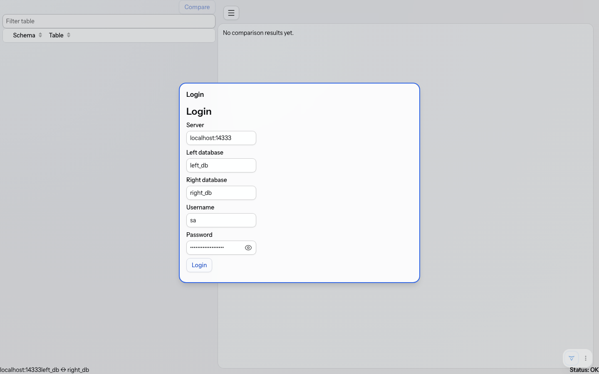
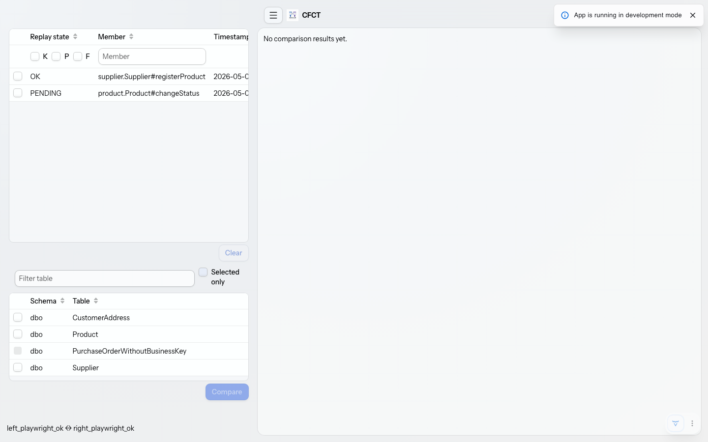
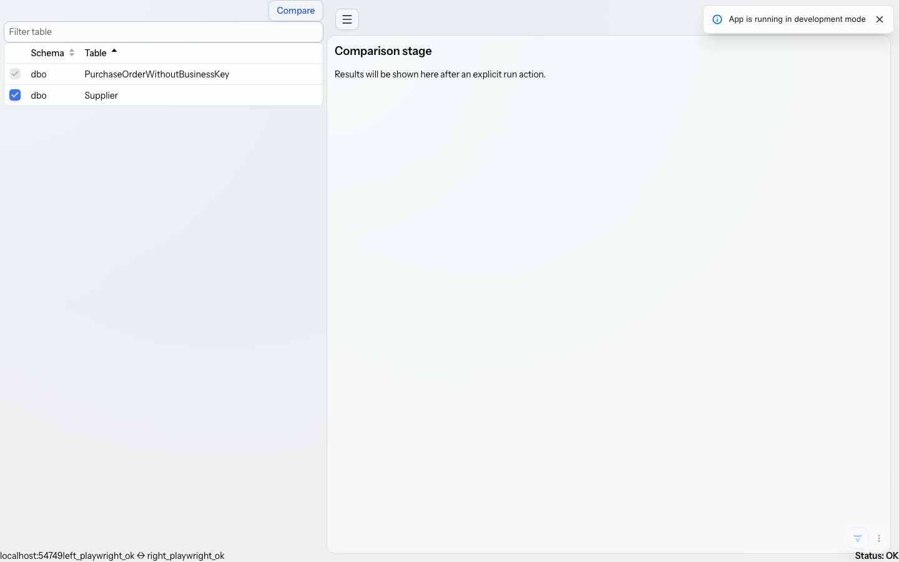
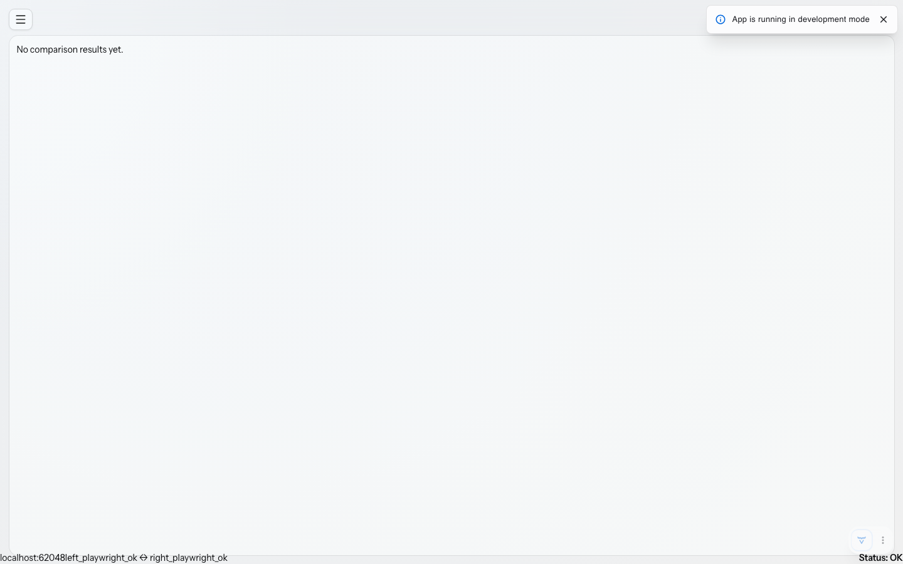
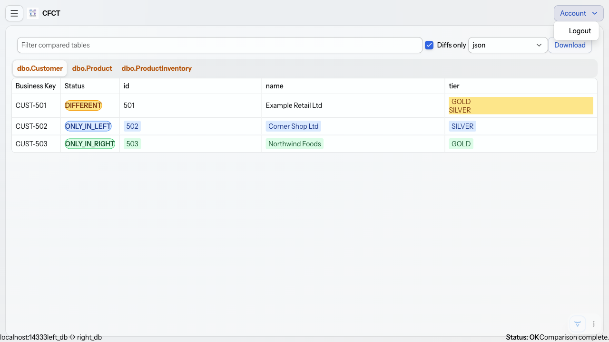
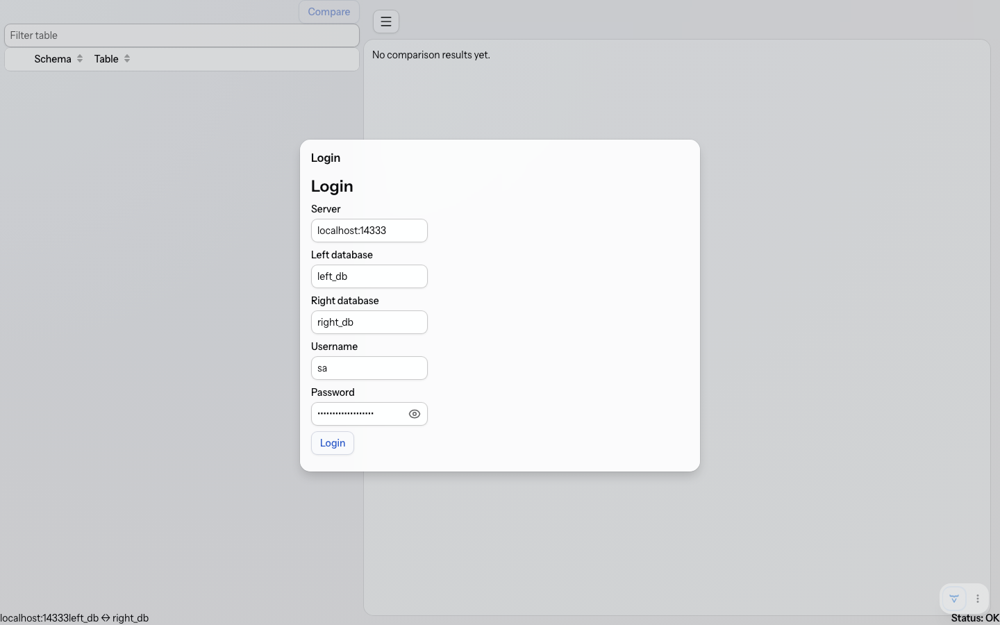

= cfct

`cfct` (Command Footprint Comparison Tool) is a webapp and CLI for comparing selected SQL Server tables between two databases, typically based on a set of Apache Causeway commands having been executed.

== User guide for Fixture SQL Server

Use `scripts/fixture-sqlserver.sh` to manage a local SQL Server container for the fixture example.
The script starts SQL Server 2022, creates `left_db` and `right_db`, and loads fixture data for the example tables.
The script also supports invalid-target and missing-system-tables modes for manual login-validation failure testing.

* To start the fixture:
+
[source,bash]
----
scripts/fixture-sqlserver.sh start
----

* To check fixture status:
+
[source,bash]
----
scripts/fixture-sqlserver.sh status
----

* To stop and remove the fixture:
+
[source,bash]
----
scripts/fixture-sqlserver.sh stop
----

By default the fixture listens on `localhost:14333` and uses the container name `cfct-fixture-sqlserver`.
Override the host port if needed:

[source,bash]
----
CFCT_FIXTURE_PORT=14334 scripts/fixture-sqlserver.sh start
----

If you change the port, also update the env file used by the CLI or the webapp configuration.

To support manual testing of sad cases:

* To start the fixture in invalid-target mode
+
[source,bash]
----
scripts/fixture-sqlserver.sh start --invalid-target-db
----
+
In this mode, one of the specified databases is missing.
Use `CFCT_INVALID_TARGET_DATABASE` to override the invalid target name used by `--invalid-target-db`.

* to start the fixture with missing required target system objects (for manual login testing):
+
[source,bash]
----
scripts/fixture-sqlserver.sh start --missing-system-tables
----
+
In this mode, the target database exists but required system tables/views are missing.

== User guide for Webapp

=== Walkthrough

Webapp usage is as follows.

* Login in a startup modal dialog with server, source database, target database, username, and password
+

+
Defaults are loaded from config props.
+
Once logged in, the footer/status bar shows connection details and status.

* After successful login, the main shell shows the initial table-selection view:
+

* Select commands in the navigation drawer, the corresponding business tables (representing the footprint) are selected.
These can be fine-tuned as required.
+
NOTE: Tables that do not meet the `_PK` suffix requirement on a unique index or unique constraint are still shown, but their checkboxes are disabled and expose the eligibility reason as tooltip text.

* Click `compare` (or hit enter); this triggers the comparison.
+
During comparison, the footer/status bar also shows live table-by-table progress and a terminal completion or failure message.
If successful, the results are shown on the right hand side:
+

+
Tabs for tables with differences are color-highlighted, and a `Diffs only` checkbox can hide unchanged tables.
Differing values are shown on separate lines, with Excel-like status coloring.
+
Downloads are provided through one unified `Download` action with a format selector for `json`, `yaml`, or `excel` (the selector defaults to `json`).

* The navigation drawer can be collapsed, to provide more real estate.
+

* Opening the account menu shows the logout action.
+

* After logout, the app returns to the login modal dialog.
+

== User Guide for CLI (`cfct.sh`)

`cfct.sh` is the root comparison wrapper script.
It expects the CLI jar to already exist and then invokes the Java CLI with an env file.

The `CFCT_CLI_JAR` can be used to override the jar path; it defaults to  `cfct-cli/target/cfct-cli-0.0.1-SNAPSHOT.jar`.

=== Connection

The target server and databases can be specified either using a `.env` file or directly.
The `.env` file is usually easiest

==== .env file

Specify the .env file directly using:

d* `-e` / `--env-file`: path to a file containing `SPRING_DATASOURCE_URL`, `SPRING_DATASOURCE_USERNAME`, `SPRING_DATASOURCE_PASSWORD`, `CFCT_LEFT_DATABASE`, and `CFCT_RIGHT_DATABASE`.
+
The `demo/.env` contains values to connect to the SQL Server fixture script:
+
[source,dotenv]
----
SPRING_DATASOURCE_URL=jdbc:sqlserver://localhost:14333;encrypt=false;trustServerCertificate=true
SPRING_DATASOURCE_DRIVER_CLASS_NAME=com.microsoft.sqlserver.jdbc.SQLServerDriver
SPRING_DATASOURCE_USERNAME=sa
SPRING_DATASOURCE_PASSWORD=Str0ng_password!123
CFCT_LEFT_DATABASE=left_db
CFCT_RIGHT_DATABASE=right_db
----
+
If not specified, will search for `.env` as per the `CFCT_ENV_FILE` env var, or in the current directory if not set.

Use `.env.TEMPLATE` as the starting point for a user-managed env file.
Copy it to `.env` in the directory from which you run `cfct.sh`, or store it elsewhere and set `CFCT_ENV_FILE`.
Do not commit real production credentials.

==== Direct options

Alternatively, the connection can be specified directly:

* `--jdbc-url`: SQL Server JDBC URL, for example `jdbc:sqlserver://localhost:14333;encrypt=false;trustServerCertificate=true`.
* `--jdbc-driver`: JDBC driver class name, for example `com.microsoft.sqlserver.jdbc.SQLServerDriver`.
* `-U` / `--username`: SQL Server username.
* `-P` / `--password`: SQL Server password.
* `-l` / `--left-database`: left database name.
* `-r` / `--right-database`: right database name.

=== Comparison Tables

The CLI provides two different ways to specify the tables to compare.
The more powerful is to specify the command range:

* `--commands-from`: inclusive command timestamp range start (ISO-8601 local date-time, for example `2026-05-01T10:00:00`).
* `--commands-to`: inclusive command timestamp range end (ISO-8601 local date-time, for example `2026-05-01T11:00:00`).

From this the audit table and logical type/table mapping is used to determine the business tables impacted.

Alternatively, the tables can be specified directly:

* `-t` / `--tables`: comma-separated `schema.table` list.
* `-F` / `--tables-file`: path to a flat file with one `schema.table` reference per line.
+
This file contains one table reference per line:
If not specified, then the `CFCT_TABLES_FILE` env var is used as a fallback.

Do not mix explicit table and command-time-range options in the same invocation.

=== Output formats

The CLI supports these output options:

* `-f` / `--output-format`: one of `text`, `json`, `yaml`, or `excel`.
+
`text` is the default when `--output-format` is omitted.

* `-o` / `--output-file`: optional output file path for successful output.
+
Excel output requires `-o`, for example:
+
[source,bash]
----
`--output-format excel -o comparison.xlsx`.
----

Text, JSON, and YAML are written to stdout as UTF-8 when `-o` is omitted.
When `-o` is supplied, successful output is written to that file instead.

CLI comparison progress is emitted to stderr as per-table progress lines so stdout or output files remain reserved for comparison artifacts.

=== Examples

These assume that the jar has been built, and the fixture started.

* Specify tables directly:
+
[source,bash]
----
./cfct.sh --env-file demo/.env --tables-file demo/tables.txt
----
+
where `demo/tables.txt` contains one table reference per line:
+
[source,text]
----
dbo.Supplier
dbo.Product
dbo.CustomerAddress
dbo.PurchaseOrder
----

* Equivalent usage with environment overrides:
+
[source,bash]
----
CFCT_ENV_FILE=demo/.env \
CFCT_TABLES_FILE=demo/tables.txt \
./cfct.sh
----
+
This overrides the JDBC URL value from the env file:

* Override the JDBC URL:
+
[source,bash]
----
./cfct.sh --env-file demo/.env --tables-file demo/tables.txt --jdbc-url "jdbc:sqlserver://localhost:14334;encrypt=false;trustServerCertificate=true"
----

* Writes JSON output instead of the default text output:

[source,bash]
----
./cfct.sh --env-file demo/.env --tables-file demo/tables.txt --output-format json
----
+
Equivalent short-flag example:
+
[source,bash]
----
./cfct.sh --env-file demo/.env --tables-file demo/tables.txt -f json
----

* Writes JSON output to a file:
+
[source,bash]
----
./cfct.sh --env-file demo/.env --tables-file demo/tables.txt --output-format json -o comparison.json
----

* Writes YAML output instead of the default text output:
+
[source,bash]
----
./cfct.sh --env-file demo/.env --tables-file demo/tables.txt --output-format yaml
----

* Writes Excel output to a workbook file:
+
[source,bash]
----
./cfct.sh --env-file demo/.env --tables-file demo/tables.txt --output-format excel -o comparison.xlsx
----

* Example command-time-range invocation:
+
[source,bash]
----
./cfct.sh \
  --env-file demo/.env \
  --commands-from 2026-05-01T10:00:00 \
  --commands-to 2026-05-01T11:00:00 \
  --output-format json
----

* Instead of using the `cfct.sh` script, you can run the CLI jar directly:

[source,bash]
----
java -jar cfct-cli/target/cfct-cli-0.0.1-SNAPSHOT.jar \
  --jdbc-url "jdbc:sqlserver://localhost:14333;encrypt=false;trustServerCertificate=true" \
  --jdbc-driver com.microsoft.sqlserver.jdbc.SQLServerDriver \
  -U sa \
  -P 'Str0ng_password!123' \
  -l left_db \
  -r right_db \
  -t dbo.Supplier,dbo.Product,dbo.PurchaseOrder \
  --output-format text
----

== Deployment Guide

Before first real-world use, ensure the target database provides these required objects as either tables or views:

* `causewayExtCommandLog.CommandLogEntry`
* `causewayExtAuditTrail.AuditTrailEntry`
* `util.LogicalTypeTableMapping`

Expected structure for these objects is:

[cols="2m,2m",options="header"]
.causewayExtCommandLog.CommandLogEntry
|===
|Column |SQL Server type

|interactionId
|UNIQUEIDENTIFIER (PK)

|executeIn
|VARCHAR(10)

|logicalMemberIdentifier
|VARCHAR(255)

|timestamp
|DATETIME2

|target
|VARCHAR(1500)

|replayState
|VARCHAR(20)
|===

[cols="2m,2m",options="header"]
.causewayExtAuditTrail.AuditTrailEntry
|===
|Column |SQL Server type

|interactionId
|UNIQUEIDENTIFIER +
(FK to CommandLogEntry.interactionId)

|sequence
|INT

|target
|VARCHAR(1500)

|propertyId
|VARCHAR(100)
|===

[cols="2m,2m",options="header"]
.util.LogicalTypeTableMapping
|===
|Column |SQL Server type

|logicalTypeName
|NVARCHAR(255)

|qualifiedName
|NVARCHAR(255)
|===

For business tables you compare, CFCT requires a unique index or unique constraint whose name ends with `_PK`.
CFCT uses this `_PK`-suffixed object to resolve business row identity during comparison.

=== Configuration reference (`application.yml`)

The webapp reads defaults from `cfct.webapp.*` properties.
Use this as a deployer reference for supported keys:

[source,yaml]
.application.yml
----
spring:
  datasource:
    url: jdbc:sqlserver://localhost:14333;encrypt=false;trustServerCertificate=true
    driver-class-name: com.microsoft.sqlserver.jdbc.SQLServerDriver
    username: sa
    password: change-me
cfct:
  webapp:
    comparison:
      left-database: left_db
      right-database: right_db
      env-file: .env
      output:
        format: text
        file:
      validation:
        enabled: true
        fail-fast: true
----

Configuration property reference:

[cols="2m,1m,3",options="header"]
|===
|Property |Default |Description

|spring.datasource.url
|jdbc:sqlserver://localhost:14333;encrypt=false;trustServerCertificate=true
|SQL Server JDBC URL shown as the default login endpoint.

|spring.datasource.username
|sa
|Default login username shown in the webapp login form.

|spring.datasource.password
|change-me
|Default login password shown in the webapp login form.

|cfct.webapp.connection.left-database
|left_db
|Default source database name used for the left-hand comparison side.

|cfct.webapp.connection.right-database
|right_db
|Default target database name used for the right-hand comparison side.

|cfct.webapp.validation.enabled
|true
|Enables login-time connectivity and required-object validation.

|cfct.webapp.validation.fail-fast
|true
|Stops login flow immediately when validation fails.

|cfct.sql.trace.enabled
|false
|Enables datasource-proxy SQL statement logging for CLI and webapp datasource usage.
|===

Migration note for older configs:

* `cfct.webapp.comparison.connection.left-database` -> `cfct.webapp.connection.left-database`
* `cfct.webapp.comparison.connection.right-database` -> `cfct.webapp.connection.right-database`
* `cfct.webapp.comparison.validation.enabled` -> `cfct.webapp.validation.enabled`
* `cfct.webapp.comparison.validation.fail-fast` -> `cfct.webapp.validation.fail-fast`
* `cfct.webapp.comparison.env-file` removed (CLI concern)
* `cfct.webapp.comparison.output.format` removed (CLI concern)
* `cfct.webapp.comparison.output.file` removed (CLI concern)

Happy-path connectivity check with the demo fixture SQL Server:

. Start the fixture SQL Server container and load demo data.
+
[source,bash]
----
scripts/fixture-sqlserver.sh start
----

. Start the webapp with fixture credentials and fixture databases.
+
[source,bash]
----
mvn -pl cfct-webapp -am spring-boot:run \
  -Dspring-boot.run.arguments="--spring.datasource.url=jdbc:sqlserver://localhost:14333;encrypt=false;trustServerCertificate=true --spring.datasource.driver-class-name=com.microsoft.sqlserver.jdbc.SQLServerDriver --spring.datasource.username=sa --spring.datasource.password=Str0ng_password!123 --cfct.webapp.connection.left-database=left_db --cfct.webapp.connection.right-database=right_db"
----
+
Or use the one-liner helper script that starts the fixture and runs the webapp with the same happy-path settings:
+
[source,bash]
----
scripts/check-webapp-happy-path.sh
----

. Open `http://localhost:8080` and click `Login` (or edit defaults first, then login).

. Confirm successful startup by checking that the app reports successful startup.

. Optional manual negative-path check for invalid target database.
+
[source,bash]
+
----
scripts/fixture-sqlserver.sh restart --invalid-target-db
----
+
Login should fail with a clear validation message.

. Optional manual negative-path check for missing required target system objects.
+
[source,bash]
----
scripts/fixture-sqlserver.sh restart --missing-system-tables
----
+
In this mode, the target database exists but required system objects are removed.
Login should fail with a clear missing-system-objects validation message.

. Stop the fixture when done.
+
[source,bash]
----
scripts/fixture-sqlserver.sh stop
----

The webapp reads login defaults and validation defaults from `cfct-webapp/src/main/resources/application.yml` using `cfct.webapp.connection.*` and `cfct.webapp.validation.*` keys.

These keys map to CLI concepts as follows:

* `spring.datasource.url` ↔ `--jdbc-url`
* `spring.datasource.driver-class-name` ↔ `--jdbc-driver`
* `spring.datasource.username` ↔ `-U` / `--username`
* `spring.datasource.password` ↔ `-P` / `--password`
* `cfct.webapp.connection.left-database` ↔ `-l` / `--left-database`
* `cfct.webapp.connection.right-database` ↔ `-r` / `--right-database`
* `cfct.webapp.validation.enabled` ↔ login-time validation switch
* `cfct.webapp.validation.fail-fast` ↔ login failure behavior

Ignore-column advisor toggles are also typesafe configuration properties.
All default to `true`.

- `cfct.comparison.ignore-column-advisors.identity-enabled`
- `cfct.comparison.ignore-column-advisors.uuid-enabled`
- `cfct.comparison.ignore-column-advisors.timestamps-enabled`
- `cfct.comparison.ignore-column-advisors.extended-properties-enabled`

For extended-property based ignores, set a column-level SQL Server extended property named `cfct.ignored`.
Truthy values are interpreted case-insensitively and include: `true`, `1`, `yes`, `y`, `on`.
The local `customer-address` fixture demonstrates this by marking `dbo.CustomerAddress.postcode` as `cfct.ignored` via `sp_addextendedproperty`.

For extended-property based value scrubbing, set a column-level SQL Server extended property named `cfct.normalizeMask`.
The value is a date/time-like mask such as `yyyy-MM-ddThh:MM.ss.SSS`.
Matching fragments are replaced with the mask literal before client-side row-difference emission.
This preserves non-masked text while suppressing timestamp-only noise.

== Developer guide

The tool consistss of a reusable comparison API, an implementation module, a Spring Boot CLI, a Vaadin webapp scaffold, a root comparison wrapper script, and a Docker-backed integration-test fixture.

=== Project layout

* `cfct.sh`: root comparison wrapper script for running the CLI with env-file and table-selection inputs.
* `.env.TEMPLATE`: template for user-managed connection configuration.
* `cfct-api`: public comparison contracts, result models, exceptions, and service interfaces.
* `cfct-impl`: comparison services, SQL Server readers, JSON request loading, and report renderers.
* `cfct-cli`: Spring Boot CLI application and executable jar packaging.
* `cfct-webapp`: Spring Boot + Vaadin Flow web application scaffold with typed configuration properties.
* `cfct-integration-tests`: SQL Server Testcontainers harness, fixture SQL, approval files, and integration tests.
* `demo/`: committed fixture example files for local comparison runs.
* `scripts/`: local helper scripts for the fixture SQL Server.

=== Module responsibilities

`cfct-cli` and `cfct-webapp` consume comparison orchestration through API interfaces from `cfct-api`.
These entry-point modules only reference `cfct-impl` for explicit Spring wiring import (`ComparisonImplementationConfiguration`).
Direct references to non-configuration classes in `cfct-impl` are intentionally disallowed and covered by architecture tests.

The webapp uses Spring-managed `DataSource` beans for SQL Server access at its service boundaries.
Connectivity validation, table discovery, and webapp comparison execution acquire short-lived JDBC connections from these DataSources and close them within the service method.

=== Naming conventions

For classes that implement an interface, implementation names follow interface-first convention: `<Interface><Qualifier>`.
Examples include `CliComparisonExecutorSqlServer`, `TableMetadataReaderSqlServer`, and `TableRowReaderSqlServer`.

=== Comparison

Default comparison behavior discovers business-key objects (unique indexes or unique constraints) using the `_PK` suffix.
By default, technical identifier columns are ignored for value comparison, including identity-backed columns, columns named `guid` or `uuid`, and SQL Server `UNIQUEIDENTIFIER` columns.
For SQL Server-backed runs on the same server instance, CFCT executes one database-side diff query per table and returns only left-only, right-only, and value-different rows.

Generated SQL is intentionally compatibility-level-100-safe and avoids post-2008 syntax such as `OFFSET/FETCH`, `IIF`, `TRY_CONVERT`, `CONCAT`, and `STRING_AGG`.
Set `cfct.sql.trace.enabled=true` in Spring configuration to emit SQL statements before execution for verification and troubleshooting.

=== Query plan and indexing expectations

Add or verify a unique index or unique constraint ending in `_PK` on every compared business table.
Ensure `_PK` key columns are selective and indexed so key joins and `EXCEPT` branches can seek instead of scanning.
For large tables, keep compared columns narrow where possible because wider compared projections increase sort and memory pressure in SQL Server execution plans.
If a table is frequently compared, monitor execution plans for hash/sort spills and add supporting nonclustered indexes that cover the `_PK` keys plus high-churn compared columns.

=== Ignored columns

The `IgnoreColumnAdvisor` SPI allows columns are ignored by default; there are four default implementations:

* identity
* UUID
* `timestamps` column
* based on the extended property `cfct.ignored` being set to a truthy value:

These can each of which can be enabled/disabled if required (enabled by default):

[source,properties]
----
cfct.comparison.ignore-column-advisors.identityEnabled=true|false
cfct.comparison.ignore-column-advisors.uuidEnabled=true|false
cfct.comparison.ignore-column-advisors.timestampsEnabled=true|false
cfct.comparison.ignore-column-advisors.extendedPropertiesEnabled=true|false
----

=== Testing conventions

Use AssertJ for fluent assertions in harness tests.
Use JUnit 5 parameterized tests with `@EnumSource` when the same behavior must be checked across the left and right logical databases or similar modes.
Use Approvals for stable textual, JSON, Excel, or tabular outputs when characterization-style verification is clearer than many small assertions.

=== Scope guardrail

The fixture scripts and integration harness are intentionally narrow.
They own local/example SQL Server lifecycle, logical database creation, fixture initialization, and smoke-test setup.
They do not implement comparison logic, reporting logic, or a broader database support matrix.

=== Prerequisites

* Java 21 or later.
* Maven 3.9 or later.
* Docker, for the fixture SQL Server and integration tests.
* Enough local resources and startup time for the `mcr.microsoft.com/mssql/server:2022-latest` container.

SQL Server container startup can be slow, especially on Apple Silicon where emulation may be involved.
The committed fixture credentials are examples for the local fixture only and are not production-safe.
Do not reuse them for real systems.

=== Build and test

Run the non-integration test suite from the repository root:

[source,bash]
----
mvn test
----

Run the full build, including SQL Server integration tests, from a Docker-enabled environment:

[source,bash]
----
mvn verify
----

Build the CLI jar and its required reactor modules before using `cfct.sh`:

[source,bash]
----
mvn -pl cfct-cli -am package
----

`cfct.sh` does not build or rebuild jars automatically.
If the CLI jar is missing, it prints the build command and exits.

Run the webapp scaffold locally from the repository root:

[source,bash]
----
mvn -pl cfct-webapp -am spring-boot:run
----

Build and run the layered webapp Docker image from the repository root:

[source,bash]
----
mvn -pl cfct-webapp -am package -DskipTests
jar tf cfct-webapp/target/cfct-webapp-0.0.1-SNAPSHOT.jar | grep 'META-INF/VAADIN/webapp/index.html'
docker build -f cfct-webapp/Dockerfile -t cfct-webapp:local .
docker run --rm -p 8080:8080 cfct-webapp:local
----

This container build requires Docker and uses Spring Boot layertools layer metadata from the packaged webapp jar.
The Maven package step runs the Vaadin production frontend build and packages `index.html` into the webapp jar.
The `jar tf` check confirms the production `index.html` is present before image assembly.
The webapp is reachable at http://localhost:8080 when the container is running.

If browser access shows a whitelabel error and logs include `Unable to find index.html`, rebuild the jar with Maven package and recheck the classpath entry above before rebuilding the image.

=== Smoke Tests

* Run webapp connectivity-validation tests (Docker required):
+
[source,bash]
----
scripts/test-webapp-connectivity-validation.sh
----

* Run headless Playwright browser tests for login + connectivity status flows (Docker required):
+
[source,bash]
----
mvn -pl cfct-webapp -am \
  -Dplaywright=true \
  -Dtest=HomePageConnectionStatusPlaywrightSuccessTest,HomePageConnectionStatusPlaywrightFailureTest \
  -Dsurefire.failIfNoSpecifiedTests=false \
  test
----
+
Playwright tests are headless and use Testcontainers-backed SQL Server settings to keep runs reproducible in local and CI environments.
+
* Run layered webapp Docker image smoke test (Docker required):
+
[source,bash]
----
scripts/test-webapp-layered-image.sh
----
+
This smoke test builds the webapp jar, validates layertools metadata, builds the layered Docker image, and checks that the container becomes reachable.

=== Docker Hub publishing with GitHub Actions

The repository includes `.github/workflows/dockerhub-publish.yml` to build and push `cfct-webapp` images to Docker Hub.
The workflow runs on pushes to `main`, pushes of tags matching `v*`, and manual `workflow_dispatch` runs.
Image tags are generated from branch or tag refs and include an immutable `sha-<commit>` tag for traceability.

Configure the following required GitHub repository secrets before enabling publish runs.

* `DOCKERHUB_USERNAME`: Docker Hub account or organization robot username with permission to push to the target repository.
* `DOCKERHUB_TOKEN`: Docker Hub access token with read and write scope for the target repository.

Optional workflow_dispatch inputs allow maintainers to tune publication behavior.

* `image_repository`: Docker Hub repository in `namespace/name` form.
If omitted, the workflow defaults to `${github.repository_owner}/cfct-webapp`.
* `extra_tags`: newline-separated extra `docker/metadata-action` tag directives.
If omitted, only the default branch, release-tag, `latest` (default branch), and `sha-*` tags are pushed.

Maintainer setup checklist:

. Create or choose a Docker Hub repository for the image.
. Add `DOCKERHUB_USERNAME` and `DOCKERHUB_TOKEN` in GitHub repository settings under Secrets and variables → Actions.
. Run the workflow manually once from the Actions tab and optionally provide `image_repository`.
. Confirm the expected tags are present in Docker Hub after the run completes.

=== Running the published Docker Hub image

After an image is published, pull and run it from Docker Hub.
Replace `<namespace>` and `<tag>` with your repository namespace and desired tag (`latest`, `v*`, or `sha-*`).

[source,bash]
----
docker pull <namespace>/cfct-webapp:<tag>
docker run --rm -p 8080:8080 <namespace>/cfct-webapp:<tag>
----

The webapp is reachable at http://localhost:8080.

=== Overriding defaults with a mounted `application.yml`

The container can load an external Spring Boot config file mounted at `/config/application.yml`.
Spring Boot automatically checks `/config` in the container config search locations.

[source,bash]
----
docker run --rm -p 8080:8080 \
  -v "$(pwd)/application.yml:/config/application.yml:ro" \
  <namespace>/cfct-webapp:<tag>
----

You can also make the config location explicit with `SPRING_CONFIG_ADDITIONAL_LOCATION`.

[source,bash]
----
docker run --rm -p 8080:8080 \
  -e SPRING_CONFIG_ADDITIONAL_LOCATION=file:/config/ \
  -v "$(pwd)/application.yml:/config/application.yml:ro" \
  <namespace>/cfct-webapp:<tag>
----

This is useful for overriding default values:

[source,yaml]
.application.yml
----
spring:
  datasource:
    url: jdbc:sqlserver://xxx;encrypt=true;trustServerCertificate=false
    driver-class-name: com.microsoft.sqlserver.jdbc.SQLServerDriver
    username: xxx
    password: xxx
cfct:
  webapp:
    comparison:
      left-database: xxx
      right-database: xxx
----

The webapp uses a login-first flow.
SQL connectivity, database existence, and required target-system object presence are validated when the user submits the login form.
Required target-system objects may be either tables or views.
The login form is pre-populated from `spring.datasource.*` plus `cfct.webapp.connection.left-database` and `cfct.webapp.connection.right-database` configuration values, and every field remains editable.

