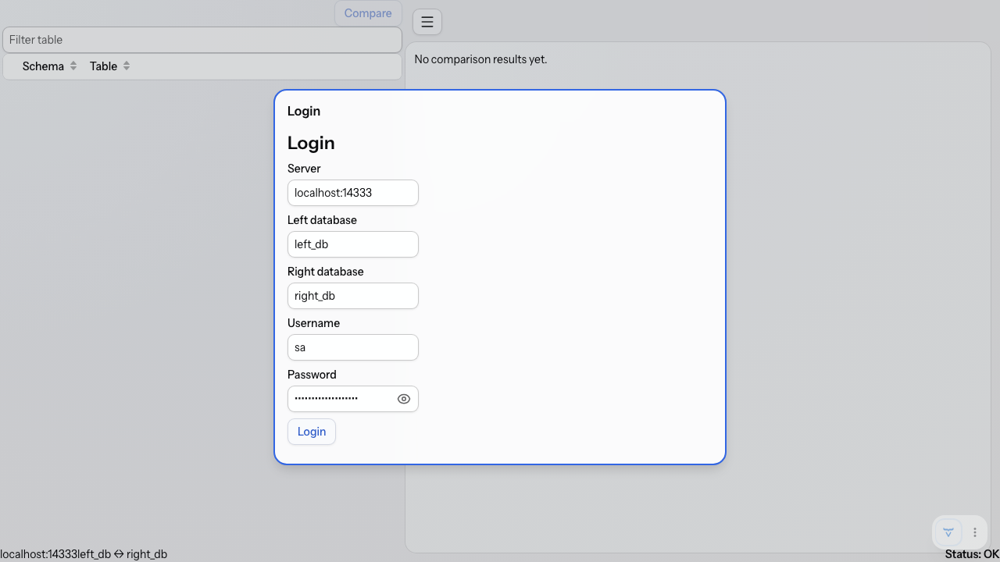
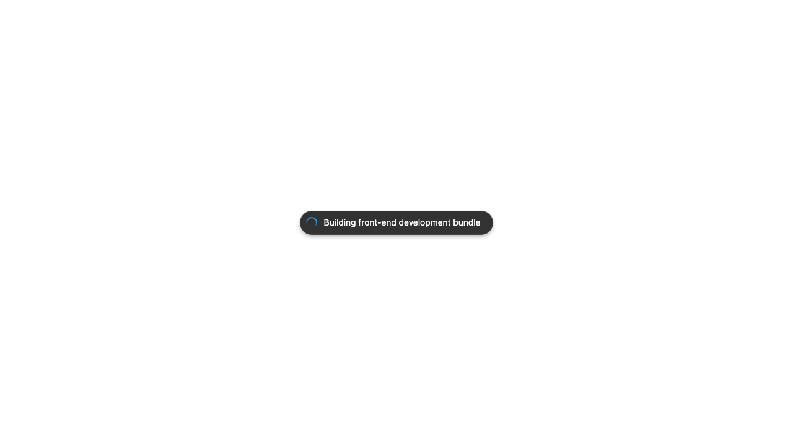
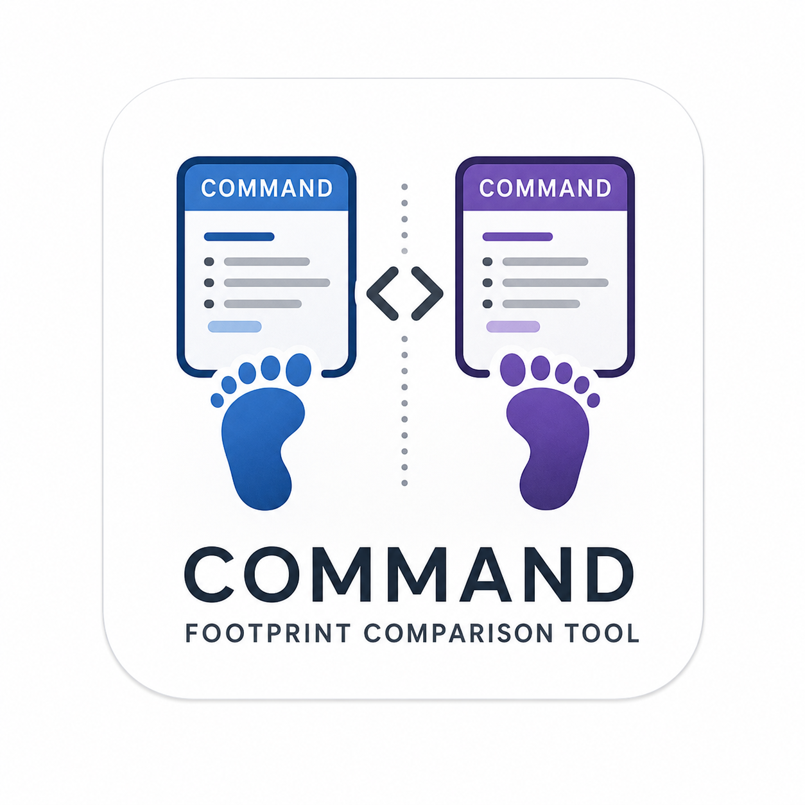
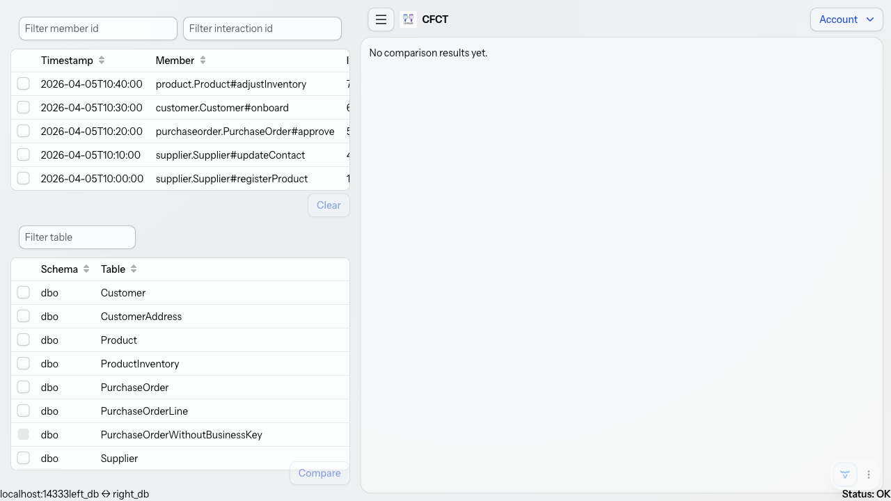

# cfct

`cfct` (Command Footprint Comparison Tool) is a Maven multi-module project for comparing selected SQL Server tables between two databases.
It provides a reusable comparison API, an implementation module, a Spring Boot CLI, a Vaadin webapp scaffold, a root comparison wrapper script, and a Docker-backed integration-test fixture.

## Project layout

- `cfct.sh`: root comparison wrapper script for running the CLI with env-file and table-selection inputs.
- `.env.TEMPLATE`: template for user-managed connection configuration.
- `cfct-api`: public comparison contracts, result models, exceptions, and service interfaces.
- `cfct-impl`: comparison services, SQL Server readers, JSON request loading, and report renderers.
- `cfct-cli`: Spring Boot CLI application and executable jar packaging.
- `cfct-webapp`: Spring Boot + Vaadin Flow web application scaffold with typed configuration properties.
- `cfct-integration-tests`: SQL Server Testcontainers harness, fixture SQL, approval files, and integration tests.
- `demo/`: committed fixture example files for local comparison runs.
- `scripts/`: local helper scripts for the fixture SQL Server.

## Module boundaries and naming conventions

`cfct-cli` and `cfct-webapp` consume comparison orchestration through API interfaces from `cfct-api`.
These entry-point modules only reference `cfct-impl` for explicit Spring wiring import (`ComparisonImplementationConfiguration`).
Direct references to non-configuration classes in `cfct-impl` are intentionally disallowed and covered by architecture tests.

The webapp uses Spring-managed `DataSource` beans for SQL Server access at its service boundaries.
Connectivity validation, table discovery, and webapp comparison execution acquire short-lived JDBC connections from these DataSources and close them within the service method.

For classes that implement an interface, implementation names follow interface-first convention: `<Interface><Qualifier>`.
Examples include `CliComparisonExecutorSqlServer`, `TableMetadataReaderSqlServer`, and `TableRowReaderSqlServer`.

## Prerequisites

- Java 21 or later.
- Maven 3.9 or later.
- Docker, for the fixture SQL Server and integration tests.
- Enough local resources and startup time for the `mcr.microsoft.com/mssql/server:2022-latest` container.

SQL Server container startup can be slow, especially on Apple Silicon where emulation may be involved.
The committed fixture credentials are examples for the local fixture only and are not production-safe.
Do not reuse them for real systems.

## Build and test

Run the non-integration test suite from the repository root:

```bash
mvn test
```

Run the full build, including SQL Server integration tests, from a Docker-enabled environment:

```bash
mvn verify
```

Build the CLI jar and its required reactor modules before using `cfct.sh`:

```bash
mvn -pl cfct-cli -am package
```

`cfct.sh` does not build or rebuild jars automatically.
If the CLI jar is missing, it prints the build command and exits.

Run the webapp scaffold locally from the repository root:

```bash
mvn -pl cfct-webapp -am spring-boot:run
```

The webapp now uses a login-first flow.
SQL connectivity, database existence, and required target-system object presence are validated when the user submits the login form.
Required target-system objects may be either tables or views.
The login form is pre-populated from `sqlcomparer.webapp.comparison.connection.*` configuration values, and every field remains editable.

Happy-path connectivity check with the demo fixture SQL Server:

1. Start the fixture SQL Server container and load demo data.

```bash
scripts/fixture-sqlserver.sh start
```

2. Start the webapp with fixture credentials and fixture databases.

```bash
mvn -pl cfct-webapp -am spring-boot:run \
  -Dspring-boot.run.arguments="--sqlcomparer.webapp.comparison.connection.server=localhost:14333 --sqlcomparer.webapp.comparison.connection.username=sa --sqlcomparer.webapp.comparison.connection.password=Str0ng_password!123 --sqlcomparer.webapp.comparison.connection.left-database=left_db --sqlcomparer.webapp.comparison.connection.right-database=right_db"
```

Or use the one-liner helper script that starts the fixture and runs the webapp with the same happy-path settings:

```bash
scripts/check-webapp-happy-path.sh
```

3. Open `http://localhost:8080` and click `Login` (or edit defaults first, then login).

4. Confirm successful startup by checking that the app reports successful startup.

Expected startup line includes:

```text
Started SqlComparerWebApplication
```

5. Optional manual negative-path check for invalid target database.

```bash
scripts/fixture-sqlserver.sh restart --invalid-target-db
```

Use the printed `Invalid target database for manual testing` value as the target database in the login form.
Login should fail with a clear validation message.

6. Stop the fixture when done.

```bash
scripts/fixture-sqlserver.sh stop
```

The webapp reads login defaults and shared execution defaults from `cfct-webapp/src/main/resources/application.yml` using `sqlcomparer.webapp.comparison.*` keys.
These keys map to CLI concepts as follows:

- `connection.server` ↔ `-S` / `--server`
- `connection.username` ↔ `-U` / `--username`
- `connection.password` ↔ `-P` / `--password`
- `connection.left-database` ↔ `-l` / `--left-database`
- `connection.right-database` ↔ `-r` / `--right-database`
- `env-file` ↔ `-e` / `--env-file`
- `output.format` ↔ `-f` / `--output-format`
- `output.file` ↔ `-o` / `--output-file`

## Webapp Usage

Webapp usage is now a three-stage workflow.
- Stage 1: login in a startup modal dialog with server, source database, target database, username, and password, with defaults loaded from config props.
- Stage 2: select eligible tables in the AppLayout navigation drawer and trigger comparison using the right-aligned `Compare` action above the table grid.
- After successful login, focus moves to the command selection grid so keyboard users can use arrow keys to navigate and Space to toggle command selection.
- When compare is enabled, pressing Enter in the selection workflow triggers Compare as the default action.
- Stage 3: view comparison output in the main comparison area as dynamic tabs, one tab per selected table.

Comparison grids use Excel-like visual cues.
Cells with differing values are highlighted, and side-only rows highlight missing-side values for faster scanning.
When result grids are wider or taller than the visible comparison area, horizontal and vertical scrollbars keep all rows and columns navigable.
In the results stage, downloads are provided through one unified `Download` action with a format selector for `json`, `yaml`, or `excel`.
The selector defaults to `json`.
Compare action spacing in the navigation drawer and results-stage action grouping evidence:



Latest evidence showing filter and downloads on the same row (downloads right-aligned):



The navigation drawer lists discovered tables in a sortable and filterable Vaadin Grid.
Tables that do not meet the `_PK` suffix requirement on a unique index or unique constraint are still shown, but their checkboxes are disabled and expose the eligibility reason as tooltip text.
The schema column auto-sizes, the select column is centered, and the select header text is intentionally blank.
The footer/status bar shows compact connection context and right-aligns current SQL connectivity status.
During comparison execution, the footer/status bar also shows live table-by-table progress and a terminal completion or failure message.
Logout is now in the top-right account menu.

The login and logout flow now looks like this.
The login experience now includes right-side CFCT branding with the product logo.
The authenticated navbar now includes compact CFCT branding with logo and name.
The branding asset is served from `cfct-webapp/src/main/resources/static/images/cfct-logo.png`.



Unauthenticated startup opens the login modal dialog on the main route.


After successful login, the main shell shows the top-right account menu.



Opening the account menu shows the logout action.


After logout, the app returns to the login modal dialog.


The initial table-selection view looks like this.


After selecting eligible tables and clicking `Compare`, the right-side stage renders per-table result tabs with compact value columns.
Tabs for tables with differences are color-highlighted, and a `Differences only` checkbox can hide unchanged tables.
Equal values are shown once, while differing values are shown inline as `L: ... | R: ...`.
Excel-like status coloring and unified JSON/YAML/Excel download controls are preserved.


When the navigation drawer is collapsed, the collapsed state is captured for visual regression coverage.


Table selection remains strategy-driven via `SelectionPlan` and is intentionally decoupled from CLI table flags.
This manual panel is the first user-facing stage and is designed to evolve toward auto-selection plus manual include/exclude overrides.

Migration notes:
- Removed: `sqlcomparer.webapp.comparison.table-selection.tables`
- Removed: `sqlcomparer.webapp.comparison.table-selection.tables-file`
- Replacement: `sqlcomparer.webapp.selection-plan.explicit.tables`

Run webapp connectivity-validation tests (Docker required):

```bash
scripts/test-webapp-connectivity-validation.sh
```

Run headless Playwright browser tests for login + connectivity status flows (Docker required):

```bash
scripts/test-webapp-playwright-connectivity.sh
```

Playwright tests are headless and use Testcontainers-backed SQL Server settings to keep runs reproducible in local and CI environments.

## Fixture SQL Server

Use `scripts/fixture-sqlserver.sh` to manage a local SQL Server container for the fixture example.
The script starts SQL Server 2022, creates `left_db` and `right_db`, and loads fixture data for the example tables.
The script also supports an invalid-target mode for manual login-validation failure testing.

Start the fixture:

```bash
scripts/fixture-sqlserver.sh start
```

Start the fixture in invalid-target mode:

```bash
scripts/fixture-sqlserver.sh start --invalid-target-db
```

In invalid-target mode, the script prints a non-existent target database name for manual login testing.

Check fixture status:

```bash
scripts/fixture-sqlserver.sh status
```

Stop and remove the fixture:

```bash
scripts/fixture-sqlserver.sh stop
```

By default the fixture listens on `localhost:14333` and uses the container name `sqlcomparer-fixture-sqlserver`.
Override the host port if needed:

```bash
SQLCOMPARER_FIXTURE_PORT=14334 scripts/fixture-sqlserver.sh start
```

If you change the port, also update the env file used by the comparison wrapper or pass a different env file with `--env-file` or `COMPAREDB_ENV_FILE`.
Use `SQLCOMPARER_INVALID_TARGET_DATABASE` to override the invalid target name used by `--invalid-target-db`.

## Comparison wrapper

`cfct.sh` is the root comparison wrapper script.
It expects the CLI jar to already exist and then invokes the Java CLI with an env file.
By default, the env file is `.env` in the current directory.
The wrapper has no default tables file; provide table selection by passing `--tables-file`, passing `-t`, or setting `COMPAREDB_TABLES_FILE`.
`--env-file <path>` takes precedence over `COMPAREDB_ENV_FILE`.

For the fixture example, build the CLI jar, start the fixture, then run:

```bash
./cfct.sh --env-file demo/.env --tables-file demo/tables.txt
```

Equivalent usage with environment overrides:

```bash
COMPAREDB_ENV_FILE=demo/.env \
COMPAREDB_TABLES_FILE=demo/tables.txt \
./cfct.sh
```

This overrides the server value from the env file:

```bash
./cfct.sh --env-file demo/.env --tables-file demo/tables.txt -S localhost:14334
```

This writes JSON output instead of the default text output:

```bash
./cfct.sh --env-file demo/.env --tables-file demo/tables.txt --output-format json
```

Equivalent short-flag example (passed through by the wrapper):

```bash
./cfct.sh --env-file demo/.env --tables-file demo/tables.txt -f json
```

This writes JSON output to a file:

```bash
./cfct.sh --env-file demo/.env --tables-file demo/tables.txt --output-format json -o comparison.json
```

This writes YAML output instead of the default text output:

```bash
./cfct.sh --env-file demo/.env --tables-file demo/tables.txt --output-format yaml
```

This writes Excel output to a workbook file:

```bash
./cfct.sh --env-file demo/.env --tables-file demo/tables.txt --output-format excel -o comparison.xlsx
```

The wrapper supports these environment overrides:

- `COMPAREDB_ENV_FILE`: env file path, defaulting to `.env` in the current directory.
- `COMPAREDB_TABLES_FILE`: optional table list file path, with no default.
- `COMPAREDB_CLI_JAR`: CLI jar path, defaulting to `cfct-cli/target/cfct-cli-0.0.1-SNAPSHOT.jar`.

## Env files and table files

Use `.env.TEMPLATE` as the starting point for a user-managed env file.
Copy it to `.env` in the directory from which you run `cfct.sh`, or store it elsewhere and set `COMPAREDB_ENV_FILE`.
Do not commit real production credentials.

`demo/.env` contains fixture-only connection values using the CLI-supported dotenv keys:

```dotenv
SQLCOMPARER_SERVER=localhost:14333
SQLCOMPARER_USERNAME=sa
SQLCOMPARER_PASSWORD=Str0ng_password!123
SQLCOMPARER_LEFT_DATABASE=left_db
SQLCOMPARER_RIGHT_DATABASE=right_db
```

`demo/tables.txt` contains one table reference per line:

```text
dbo.Supplier
dbo.Product
dbo.CustomerAddress
dbo.PurchaseOrder
```

These demo files are examples for the local fixture only.
Do not put production credentials in committed demo files.

## Direct CLI usage

You can run the CLI jar directly after building it:

```bash
java -jar cfct-cli/target/cfct-cli-0.0.1-SNAPSHOT.jar \
  -S localhost:14333 \
  -U sa \
  -P 'Str0ng_password!123' \
  -l left_db \
  -r right_db \
  -t dbo.Supplier,dbo.Product,dbo.PurchaseOrder \
  --output-format text
```

The CLI supports these connection options:

- `-S` / `--server`: SQL Server host, optionally including a port such as `localhost:14333`.
- `-U` / `--username`: SQL Server username.
- `-P` / `--password`: SQL Server password.
- `-l` / `--left-database`: left database name.
- `-r` / `--right-database`: right database name.

The CLI supports these table-selection options:

- `-t` / `--tables`: comma-separated `schema.table` list.
- `-F` / `--tables-file`: path to a flat file with one `schema.table` reference per line.

The CLI supports these dotenv options:

- `-e` / `--env-file`: path to a file containing `SQLCOMPARER_SERVER`, `SQLCOMPARER_USERNAME`, `SQLCOMPARER_PASSWORD`, `SQLCOMPARER_LEFT_DATABASE`, and `SQLCOMPARER_RIGHT_DATABASE`.

Default comparison behavior now discovers business-key objects (unique indexes or unique constraints) using the `_PK` suffix.
By default, technical identifier columns are ignored for value comparison, including identity-backed columns, columns named `guid` or `uuid`, and SQL Server `UNIQUEIDENTIFIER` columns.
The default ignored set still includes `version`.

The CLI supports these output options:

- `-f` / `--output-format`: one of `text`, `json`, `yaml`, or `excel`.
- `-o` / `--output-file`: optional output file path for successful output.

`text` is the default when `--output-format` is omitted.
Text, JSON, and YAML are written to stdout as UTF-8 when `-o` is omitted.
When `-o` is supplied, successful output is written to that file instead.
CLI comparison progress is emitted to stderr as per-table progress lines so stdout or output files remain reserved for comparison artifacts.
Excel output requires `-o`, for example `--output-format excel -o comparison.xlsx`.

Explicit CLI values override values loaded from `--env-file`.
Use either `-t` or `--tables-file`, not both.

## Testing conventions

Use AssertJ for fluent assertions in harness tests.
Use JUnit 5 parameterized tests with `@EnumSource` when the same behavior must be checked across the left and right logical databases or similar modes.
Use Approvals for stable textual, JSON, Excel, or tabular outputs when characterization-style verification is clearer than many small assertions.

## Scope guardrail

The fixture scripts and integration harness are intentionally narrow.
They own local/example SQL Server lifecycle, logical database creation, fixture initialization, and smoke-test setup.
They do not implement comparison logic, reporting logic, or a broader database support matrix.
